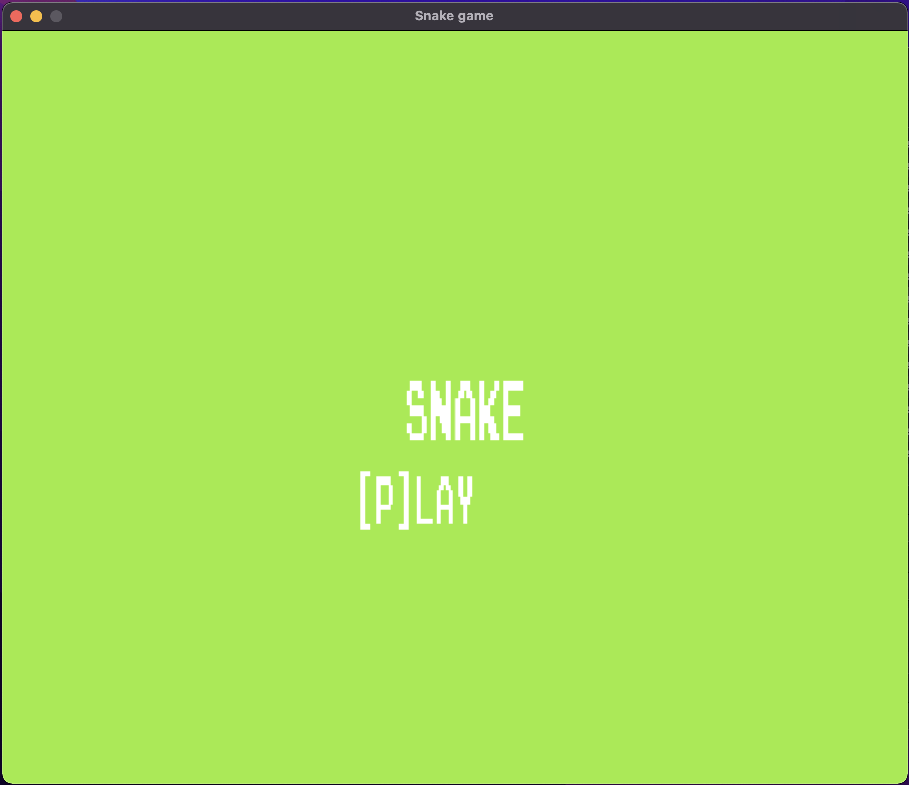
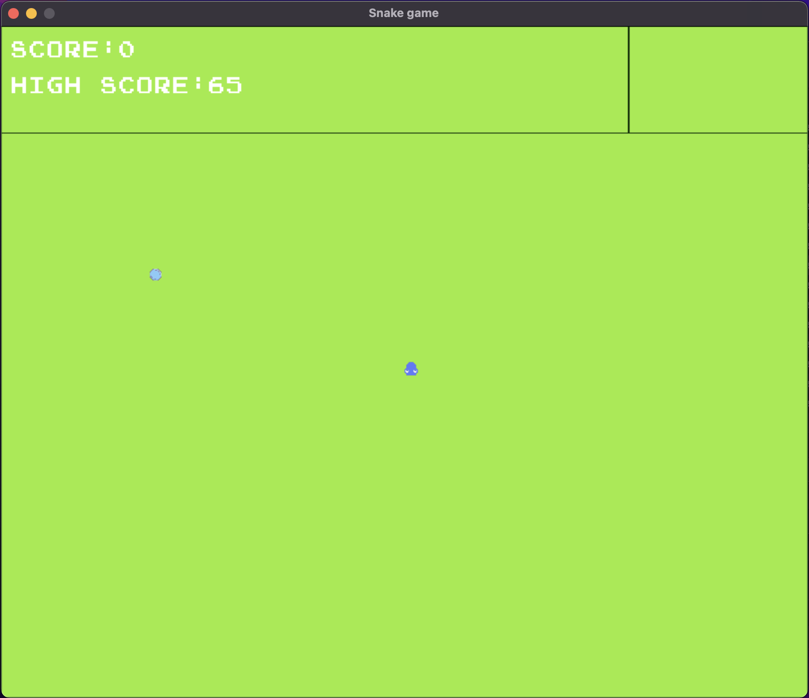
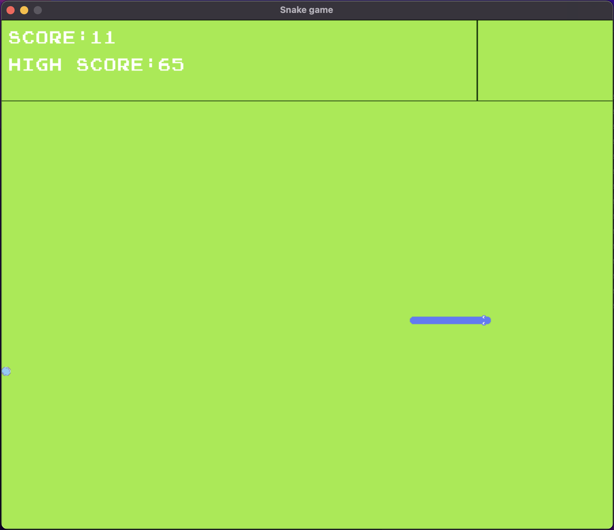

# Snake Game

This is a simple implementation of the classic Snake game using SDL2 library.

## Prerequisites

To compile and run the Snake game, you need to have the following dependencies installed:

- C++ Compiler (e.g., g++)
- SDL2 Library
- CMake

## Installation

1. Clone the repository
2. Change directory to the repository
3. Create a directory for the build files inside the repository
4. Change directory to the build directory and build the project

```sh
cmake ..
cmake --build .
```

## Usage

Run the executable file in the build directory or from the command line:

```sh
./Snake
```

## Controls

- Press `p` when in the menu to start playing.
- Use WASD to control the snake's movement.

## Preview







### Mentions
- [SDL2](https://www.libsdl.org/)
- [opengameart](https://opengameart.org/content/snake-game-assets)
